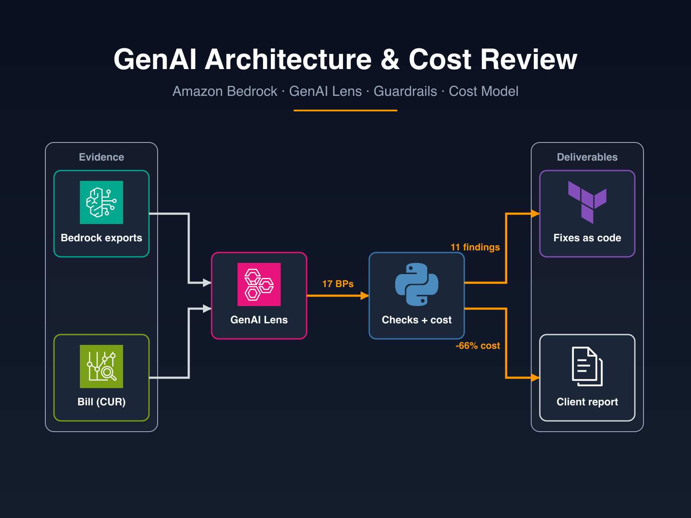
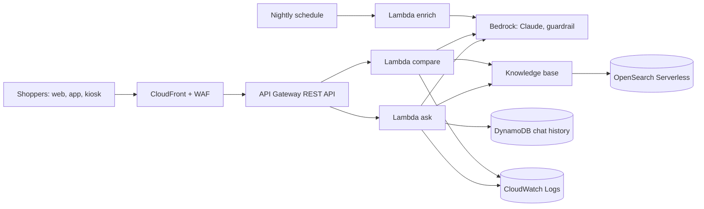

# AWS GenAI architecture review sample

A review deliverable for one generative AI workload on Amazon Bedrock: findings mapped to the AWS Well-Architected
Generative AI Lens, ranked by risk, each with the code that fixes it, and a monthly cost model before and after the
fixes, all generated from data and checked by tests.

[](https://github.com/gamaware/aws-genai-architecture-review-sample/actions/workflows/ci.yml)
[](LICENSE)




> **Fictional sample.** Harbor Goods and all data here are fictional. Each repository in this portfolio is a
> separate engagement with Harbor Goods, a fictional mid-size retailer. Account IDs are AWS documentation examples.

## Executive summary

Harbor Goods, a fictional mid-size retailer, shipped a customer-facing product Q&A assistant on Amazon Bedrock. The
Bedrock bill grows every month, the security team asked about prompt injection and personal data in logs, and nobody
measures answer quality before a change ships. The team asked for an independent review with fixes they can apply.

<!-- BEGIN GENERATED: headline -->

17 Generative AI Lens best practices reviewed, 6 met. 11 findings: 3 high, 6 medium and 2 low risk. The recommended
changes take the modeled monthly bill from $22,225.91 to $9,590.74 ($12,635.17 less, 57%), after paying for the added
guardrail coverage and invocation logging.

<!-- END GENERATED: headline -->

Top three recommendations, in ranked order:

<!-- BEGIN GENERATED: top-recommendations -->

1. **The Lambda role allows `bedrock:*` on every resource** (GENSEC01-BP01, High risk, effort S). Replace the statement
   with bedrock:InvokeModel and bedrock:InvokeModelWithResponseStream on the three application inference profiles and
   their foundation models, bedrock:ApplyGuardrail on the guardrail, bedrock:Retrieve on the knowledge base, and the
   batch inference actions for the enrich job only.
2. **Application logs keep customer prompts with personal data, unencrypted and forever** (GENSEC04-BP02, High risk,
   effort M). Stop logging raw prompts (log token counts and request IDs), redact PII in the handler before any log
   call, anonymize PII in the guardrail, and encrypt the log groups with a customer managed KMS key and a retention
   period.
3. **The compare route calls the model with no guardrail** (GENSEC02-BP01, High risk, effort S). Attach one versioned
   guardrail to every route: prompt-attack and content filters, the denied competitor-pricing topic, and PII
   anonymization on input and output. Call it through guardrailConfig on each Converse request.

<!-- END GENERATED: top-recommendations -->

The sample demonstrates:

- A review against the Generative AI Lens with best-practice IDs and titles as AWS publishes them
  (`GENSEC02-BP01`, `GENCOST03-BP03`).
- Scripted checks over read-only exports (Terraform state, IAM, Bedrock settings, logs, the bill, pipeline) that
  decide each finding and re-run after the fixes.
- A model right-sizing decision taken from a golden-set evaluation with an explicit quality bar, not from price alone.
- Fixes as code: Terraform for the guardrail, invocation logging, KMS, inference profiles, scoped IAM, throttling and
  S3 Vectors, tested with a mocked provider; application code for prompt caching, guardrail calls, log redaction,
  retries, batch inference and a release gate, tested against stubbed Bedrock clients.
- A cost model that reconciles with the bill first, then prices each lever, including the fixes that add cost.

## Inspect the deliverable

| Artifact | Contents |
| --- | --- |
| [`report/REPORT.md`](report/REPORT.md) | The client report: summary, findings by pillar, cost model, fixes, roadmap, lens coverage, evidence |
| [`report/REPORT.pdf`](report/REPORT.pdf) | The same report as the client receives it |
| [`evidence/findings.csv`](evidence/findings.csv) | Ranked findings ready to import into a tracker |
| [`evidence/cost-model.json`](evidence/cost-model.json) | Monthly cost by component and by lever, as found and after the fixes |
| [`fixes/terraform/`](fixes/terraform/) | The account-level fixes, with `terraform test` assertions |
| [`fixes/app/`](fixes/app/) | Request path, batch job and release gate |
| [`data/synthetic/as-found/`](data/synthetic/as-found/) | The exports the checks read |
| [`docs/methodology.md`](docs/methodology.md) | How the review runs: scope, exports, golden set, checks, findings, cost model, fixes |

## Scenario and acceptance criteria

The assistant answers product questions (`ask`) and compares products (`compare`) for shoppers on the web store, the
mobile app and store kiosks, and a nightly job (`enrich`) rewrites catalog descriptions. It runs on Amazon
CloudFront, Amazon API Gateway, AWS Lambda, Amazon Bedrock (Claude models, guardrails, a knowledge base on Amazon
OpenSearch Serverless), Amazon DynamoDB and Amazon Cognito, deployed with Terraform.

Constraints: one workload, read-only exports reviewed offline, a two-hour interview, and no changes to the client's
accounts.

The client accepts the deliverable when:

- every best practice in scope has a status and at least one evidence ID;
- every finding has a risk rating, an effort estimate, an owner, a recommendation and the file that fixes it;
- the cost model reconciles with the latest month of the bill within 1% before it claims any saving;
- the review recommends a model change only where the cheaper model meets the agreed quality bar;
- one command (`make verify`) reproduces every number in the report and tests every fix, offline.

## Architecture





As found: the compare route has no guardrail, the functions share a role with `bedrock:*` on `*`, raw prompts go to
unencrypted logs, invocation logging is off, the API has no throttling, every route runs Claude Sonnet without prompt
caching, the enrich job runs on-demand, and the vector store runs four OCUs for 2 GB of vectors. The
[report](report/REPORT.md) lists each finding with its evidence and fix.

## Verify locally

Prerequisites: [uv](https://docs.astral.sh/uv/) 0.12 or later (CI pins 0.12.19; it installs Python 3.13 and the
pinned packages from `uv.lock`), GNU Make, Terraform 1.14.5, tflint 0.61.0 and Trivy 0.74.0. Checkov 3.3.19 and
Semgrep run through `uv tool run`. `make pdf` also needs Docker; it runs the same pinned pandoc LaTeX image as CI.

```bash
make setup    # install the pinned toolchain into .venv
make verify   # ruff, tests, output check, Terraform checks and tests, Checkov, Trivy, Semgrep
```

Expected output ends with:

```text
verify: all checks passed
```

The build needs no AWS account and makes no AWS calls; the Terraform tests use a mocked provider. The first run
downloads packages, the AWS provider, the tflint ruleset, Semgrep rules and the Trivy checks bundle.

Other targets: `make evidence` regenerates `evidence/` and the report blocks after a data change, and `make pdf`
renders `report/REPORT.pdf`. The repository has no live test target; see
[ADR 0004](docs/adr/0004-offline-verification-no-live-target.md).

## Repository map

```text
data/pricing.yaml          Unit prices with their source pages
data/synthetic/            Workload, lens scope, check metadata, evidence register
data/synthetic/as-found/   Fictional exports: Terraform state, IAM, Bedrock settings, logs, eval, CUR, pipeline
scripts/genai_review/      Checks, cost model, ranking and rendering (python -m genai_review generate|check)
fixes/terraform/           Account-level fixes and their mocked terraform tests
fixes/app/                 Request path, batch job and release gate
fixes/pipeline/            Evaluation stage for the client's pipeline
evidence/                  Generated: findings (CSV, JSON), check results, lens status, cost model
report/                    REPORT.md (canonical), REPORT.pdf (generated)
tests/                     Check, cost model, report and fix tests, and an independent reference implementation
docs/methodology.md        How the review runs
docs/adr/                  Decision records
docs/assets/               Social preview spec
```

## Decisions and trade-offs

Architecture decision records follow the *Fundamentals of Software Architecture* (2nd ed.) format.

| Number | Title | Status |
| --- | --- | --- |
| [0001](docs/adr/0001-checks-as-code-findings-as-data.md) | Decide best practices with scripted checks and generate the report from them | Accepted |
| [0002](docs/adr/0002-rank-by-risk-then-saving.md) | Rank findings by risk, then saving, then effort, and phase them by risk | Accepted |
| [0003](docs/adr/0003-sequential-levers-reconciled-with-cur.md) | Price levers in a fixed order and reconcile the model with the bill first | Accepted |
| [0004](docs/adr/0004-offline-verification-no-live-target.md) | Verify offline, with no live test target | Accepted |
| [0005](docs/adr/0005-pdf-with-shared-pandoc-image.md) | Render the PDF with the shared pandoc LaTeX image | Accepted |
| [0006](docs/adr/0006-documented-checkov-skips.md) | Skip two Checkov rule groups inline, with the reason next to the resource | Accepted |

## Security and quality gates

| Gate | Where | Why |
| --- | --- | --- |
| `make verify` | CI and locally | The report numbers follow from the data, and tests cover every fix |
| `terraform test` (mocked), tflint | `make verify` and pre-commit | The Terraform fixes carry the controls each finding needs |
| Checkov, Trivy, Semgrep | `make verify` and CI (shared `security`) | Code and configuration scanning |
| PDF build and evidence rerun | CI (shared `report`) | The report must render, and `make evidence` must reproduce `evidence/` |
| markdownlint, link check, prose lint | CI (shared `lint-docs`) | The report and docs are the product |
| actionlint, zizmor | CI (shared `lint-actions`) and pre-commit | Workflows keep narrow token access and pinned actions |
| gitleaks, detect-secrets | CI (shared `secrets`) and pre-commit | No credentials in a public repository |
| Account ID test | `tests/test_report.py` | Only AWS documentation example account IDs may appear |

Workflows start from `permissions: {}`, pin actions to full commit SHAs, and never receive cloud credentials.

## Limits and production adaptations

- Harbor Goods, its traffic, logs, bill and evaluation results are fictional. The findings show the format and the
  reasoning, not the state of any real system.
- Unit prices in `data/pricing.yaml` are list prices; an engagement re-checks them before the report goes out.
- The checks read exports; they do not replace a penetration test or red-team exercise against the live assistant.
- The Terraform fixes take the client's existing role names and API ID as variables. In an engagement they go through
  the client's pipeline, staging first, and the client imports the Lambda log groups and the ask and compare API
  methods before the first apply.

## Built on

- [AWS Well-Architected Generative AI Lens](https://docs.aws.amazon.com/wellarchitected/latest/generative-ai-lens/generative-ai-lens.html):
  the review method and best-practice IDs (cited, not copied).
- [Guidance for a multi-provider generative AI gateway on AWS](https://github.com/aws-solutions-library-samples/guidance-for-multi-provider-generative-ai-gateway-on-aws)
  (MIT-0) and [Generative AI Use Cases](https://github.com/aws-samples/generative-ai-use-cases) (MIT-0): reference
  architectures for quotas, cost attribution and the shape of the reviewed application. This repository copies no
  code from them; the as-found snapshot is original.
- [Amazon Bedrock pricing](https://aws.amazon.com/bedrock/pricing/): unit prices in the cost model.

## Related work

Part of the [AWS DevOps portfolio](https://github.com/gamaware/aws-devops-portfolio); it backs the "GenAI
architecture and cost review" service:
[GenAI architecture and cost review on Upwork](https://www.upwork.com/freelancers/~014b3520cf9e140103). The method is
the one Alex uses in audits for ITESO and freelance clients in Guadalajara. Contribution, conduct and support
guidelines come from [gamaware/.github](https://github.com/gamaware/.github); see also [SECURITY.md](SECURITY.md) and
[CHANGELOG.md](CHANGELOG.md).

## License

[MIT](LICENSE)
